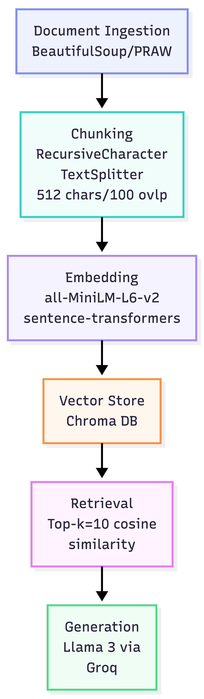

# Project 1 Planning: The Unofficial Guide

> Write this document before you write any pipeline code.
> Your spec and architecture diagram are what you'll use to direct AI tools (Claude, Copilot, etc.) to generate your implementation — the more specific they are, the more useful the generated code will be.
> Update the Retrieval Approach and Chunking Strategy sections if you change your approach during implementation.
> Update this file before starting any stretch features.

---

## Domain

<!-- What domain did you choose? Why is this knowledge valuable and hard to find through official channels? -->
This is an unofficial collection of student perspectives on the CU Boulder Computer Science department, covering professors, courses, workload, grad admissions, campus culture, and cost of living. This knowledge helps students make informed decisions that official sources can't support — official channels only surface credentials, syllabi, and institutional messaging, with no incentive to publish negative feedback, difficulty warnings, or honest comparisons between instructors.

---

## Documents

<!-- List your specific sources: URLs, subreddit names, forum threads, or file descriptions.
     Aim for at least 10 sources that together cover different subtopics or perspectives within your domain. -->

| # | Source | Description | URL or location |
|---|--------|-------------|-----------------|
| 1 | Rate my professor | Website that is commonly used to rate a professor for a specific university, their quality and difficulty of the class | https://www.ratemyprofessors.com/search/professors/1087?q=* |
| 2 | Reddit | Students describing their experiences and thoughts about cs department of CU Boulder | https://www.reddit.com/r/cuboulder/comments/1qkaql1/perspectives_from_cu_boulder_cs_majors/ |
| 3 | CUBoulderGradesDatabase  | Database on average grades in each class  | https://web.navan.dev/BuffClassesEDA/ |
| 4 | Niche | Overall review of cu boulder | https://www.niche.com/colleges/university-of-colorado-boulder/reviews/ |
| 5 | GradCafe | MS/PhD program application |https://www.thegradcafe.com/survey?q=University+of+Colorado+Boulder&program=Computer+Science |
| 6 | Reddit | Cost of attendance |https://www.reddit.com/r/cuboulder/comments/1jnjloz/is_there_any_way_to_reduce_cost_of_attendance/ |
| 7 | Reddit | Diversity and acceptance | https://www.reddit.com/r/cuboulder/comments/1i8fgrx/how_accepting_is_cu_of_trans_people/ |
| 8 | Coursicle| Course ratings |  https://www.coursicle.com/colorado/courses/CSCI/ |
| 9 | Indeed| TA, employee reviews | https://www.indeed.com/cmp/Univeristy-of-Colorado-Boulder-1/reviews |
| 10 | Reddit | Dorm life tips| https://www.reddit.com/r/cuboulder/comments/1tske4d/if_youre_moving_into_a_dorm_for_the_first_time/ |

---

## Chunking Strategy

<!-- How will you split documents into chunks?
     State your chunk size (in tokens or characters), overlap size, and explain why those
     numbers fit the structure of your documents.
     A review-heavy corpus warrants different chunking than a long FAQ. -->

**Chunk size:**
512 characters, there's a wide variety of data types some are one liner statistic data on the course and some are long discussion forumns from reddit. Even though the post itself is long, it is often split into multiple paragraphs or have different meanings.

**Overlap:**
100 characters. The average sentence is typically 15-20 words so around 75-100 characters. Given that these discussion posts are informal and often have multiple points in one post (with one overarching topic), 100 characters overlap should retain enough context to connect a chunk back to the broader point being made.

**Reasoning:**
Over half of the sources are comments that fall within the 250 - 300 character range, but some of the sources are of long discussion posts with multiple points in an overarching topic. The 512 isn't going to be enough for the entire post but it should be relatively good for a single paragraph or point in these long posts. Paragraph splitting would have difficulties with the inline structure from reddit.
---

## Retrieval Approach

<!-- Which embedding model are you using (e.g., all-MiniLM-L6-v2 via sentence-transformers)?
     How many chunks will you retrieve per query (top-k)?
     If you were deploying this for real users and cost wasn't a constraint, what tradeoffs
     would you weigh in choosing a different embedding model — context length, multilingual
     support, accuracy on domain-specific text, latency? -->

**Embedding model:**
all-MiniLM-L6-v2

**Top-k:**
10

**Production tradeoff reflection:**
If I were to develop this for production users I'd weigh faithfulness, cost and speed, currently this will only be used by CU boulder students which the enrollment number this year is 38k. At this number speed and faithfulness to the original comment is important because we don't want to wrap any honest reviews from previous students. But if we were to expand this to all universities acorss united states for example we'd want to heavily weigh in on cost given the shear number of users could increase up to 18 million people.

---

## Evaluation Plan

<!-- List your 5 test questions with their expected correct answers.
     Questions should be specific enough that you can judge whether the system's response
     is right or wrong. "What are good dining halls?" is too vague.
     "What do students say about wait times at [dining hall name] during lunch?" is testable. -->

| # | Question | Expected answer |
|---|----------|-----------------|
| 1 | Is CJ Herman's class difficult? | Yes 4.6 out of 5.0 overall difficulty |
| 2 | What are some options to reduce cost of attendance? | Use library's course reserves for some textbooks, RA, community college credits |
| 3 | What are some tips for doing laundry in a CU Boulder dorm? | Based on the Reddit dorm tips thread, laundry is least crowded early in the week and most crowded on Sunday. Students should set a phone timer for their laundry so someone doesn't pull wet clothes out onto the floor to use the machine. Detergent sheets are recommended over tide pods after a bag popped open during a move. A hamper bag is also suggested over a basket since dorms often require climbing stairs to reach laundry machines. |
| 4 | Who's a good professor for CSCI 3104 algorithms? | Based on Coursicle, Joshua Grochow is frequently recommended — students describe him as caring, very available at office hours, and responsive to emails. The tradeoff is an extremely heavy homework load. Known professors for this course include Grochow, Robby Green, Peter Ly, Benjamin Waggoner, and Mary Monroe among others. |
| 5 | What GPA do I need to get into the CU Boulder MS CS program?" |  Based on GradCafe Fall 2026 data, accepted MS students have GPAs around 3.70 (one confirmed acceptance at 3.70). PhD rejections are coming in across a wide GPA range including 3.65, 3.78, 3.81, 3.83, 3.87, 3.91, 3.98, and even 4.00 — suggesting PhD admissions is highly competitive beyond just GPA, with research experience and publications mattering significantly.|

---

## Anticipated Challenges

<!-- What could go wrong? Name at least two specific risks with reasoning.
     Consider: noisy or inconsistent documents, missing source attribution, off-topic
     retrieval, chunks that split key information across boundaries. -->

1. Reddit replies such as 'yes this is the way 100%' or comments that shift to slightly different sub-topics can lose context from the original post when chunked in isolation, making it difficult for the retriever to determine relevance.

2. Noisy data from GradCafe and BuffClassesEDA because the data structure is so different, and getting the data into the embedding may pose difficulties as well 

---

## Architecture

<!-- Draw a diagram of your pipeline showing the five stages:
     Document Ingestion → Chunking → Embedding + Vector Store → Retrieval → Generation
     Label each stage with the tool or library you're using.
     You can use ASCII art, a Mermaid diagram, or embed a sketch as an image.
     You'll use this diagram as context when prompting AI tools to implement each stage. -->

---

## AI Tool Plan

<!-- For each part of the pipeline below, describe:
     - Which AI tool you plan to use (Claude, Copilot, ChatGPT, etc.)
     - What you'll give it as input (which sections of this planning.md, which requirements)
     - What you expect it to produce
     - How you'll verify the output matches your spec

     "I'll use AI to help me code" is not a plan.
     "I'll give Claude my Chunking Strategy section and ask it to implement chunk_text()
     with my specified chunk size and overlap" is a plan. -->

**Milestone 3 — Ingestion and chunking:**
I'll give Claude my Chunking strategy section and ask it to implement chunk_test() with my specific chunk size and overlap

**Milestone 4 — Embedding and retrieval:**
I'll give Claude my Retreival approach section and ask it to implement and guide me on using all-MiniLM-L6-v2 for embedding model on my data and storing it in ChromaDB.

**Milestone 5 — Generation and interface:**
I'll give Claude my Architecture diagram and Retrieval Approach section and ask it to implement a generate_response() function that takes retrieved chunks and passes them as context to Llama 3 via Groq, then wire it to a simple CLI or Gradio interface.